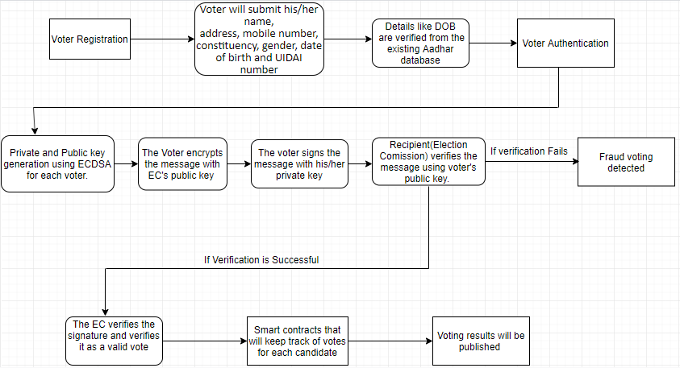

# Agni
This is a voting system based on Azure Blockchain.This web application have been built for Microsoft Codefundo++ 2019 hackathon.
## E-VOTING SYSTEM USING MICROSOFT AZURE BLOCKCHAIN
## Abstract
We are implementing voting system using Azure Blockchain. We aim to achieve a secure and robust system that ensures anonymity of the voter, transparency in the process and provable correctness. Most existing E-Voting systems are based on centralized servers where the voters must trust the organizing authority for the integrity of the results.
## Proposed Solution
We are proposing a decentralized voting system which ensures:

1. Voting data immutability
2. Data Integrity
3. Decentralization of the voter registration and validation mechanism
4. Transparency in the voting system 
5. Public Visualization of the smart contract restricting each legitimate voter to have only a single vote

The proposed voting protocol utilizes the blockchain to store the cast ballots as it enables a group of people to maintain a public ledger that is owned, updated and maintained by every user but controlled by no one. 

## Working of proposal

## 1. Voter Registration and Authentication
We are using the ECDSA (Elliptic Curve Digital Signature Algorithm) which is one of the Elliptic Curve Cryptographic schemes which provides the necessary cryptographic primitives for data authentication, data integrity, and non-repudiation. Authentication using Elliptic Curve Cryptography (ECC) is secure, where all participating devices have a registered key pairs which includes a “private key” and “public key”.

The private key is used by the originator to sign a message, and the recipient uses the originator’s public key to verify the authenticity of the signature. If a message is modified on its way to the recipient, the signature verification fails because the original signature is not valid for the modified message. ECDSA provide benefits including small signature sizes and minimal bandwidth compared to another available digital signatures.

For user registration, voter will enter their personal identification details such as name, address, mobile number, constituency, gender, date of birth and UIDAI number. Strong attributes are address, birth date, phone number and UIDAI number Here we make use of the fully set up Aadhaar card system as it will allow us to get the method to verify their date of birth as it was already verified during Aadhaar card registration process. As the election commission is a sovereign body, it would have access to the Aadhaar card database. Election Commission has every registered individual‘s public key and during registration will tie together the valid Aadhaar responses to the public key furnished by the voter which is generated. 

## 2. Voting
During voting time, the person has to first encrypt his/her vote using the receiver’s (Election Commission) public key. After the vote is encrypted, the voter has to sign the vote using his/her private key. So, the vote has been encrypted and signed, it will now be easy for the Election Commission to verify the vote that has been casted 
Using the voter’s public key.

## 3. Smart Contracts (Elections)
Our election smart contract is an autonomous agent executing during election voting and is the main building block of our decentralized application. It will restrict every user to vote only once and will authenticate the user and increment the cast vote, mapped by the user’s ID and return the total number of votes cast so far.

Every vote is considered as a transaction and can be deployed on the blockchain. In addition, every vote is signed by the voter himself, thus maintaining the integrity and ownership of the vote, which is then verified by the Election Commission.

## 4. After Voting
Since it’s an electronic voting system, voting records can be generated in real time. However, the real-time report of who is leading and who is lagging should not be made public as it might affect public sentiments which is acting as a biased move towards particular candidate. After the voting completion, detailed analysis about a candidate’s result, party-wise results, constituency results, etc. can be easily prepared.

## 5. Future Work
We are now initially maintaining a centralized authentication entity in the form of election commission and in the future we will work on building a decentralized authentication and verification system by implementing Elliptic Curve Cryptography and applying the concept of digital signature and digital certificate.
